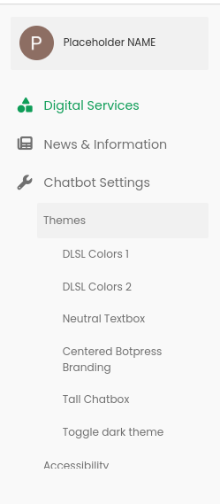

# 🤖 Botpress Channel-Web Examples Folder for MyDCampus
This is the repository for the MyDCampus Botpress Chatbot Channel-Web Examples folder.

You can directly clone this repo into the examples folder in the channel-web folder which can be located at `../botpress/data/assets/modules/channel-web/examples/` (the folder  needs to be empty first). After that, the files should be inside the examples folder.

```bash
cd ../botpress/data/assets/modules/channel-web/examples/ # the ../ is where you have botpress installed
git clone https://github.com/pangilinan-patrick/MyDCampus-Channel-Web.git .
```

The site is then tested with this link (Botpress must be running and the `.tgz` file has been imported using the Botpress admin site): `http://localhost:3000/assets/modules/channel-web/examples/MyDCampusPortal.html?botId=draft`

## 📁 Important Files
The `My DCampus Portal_Files` folder contains the assets for the `MyDCampusPortal.html/php` website. The main CSS file for the website inside the folder is `app.min.css`

The chat bot injection script is in `MyDCampusPortal.html/php` found around `line 520`, or you can just `Ctrl + F + "chatbot script"` to find it. You can also make edits to the sidebar navigation around `line 140` which contains the settings front-end for the chat bot settings.

The main chatbot script and other related scripts are located around `line 650`.

The `Themes` folder contains the CSS file for each theme that's used by the chat bot.

The `.tgz` file is to be imported in the Botpress admin panel to work with an up to date chat bot at all times.

The `Database Files` folder contains the needed database files to aid in the chatbot's ability to answer user's queries.

## ✅ Features
<table>
  <tr>
    <th>Feature</th>
    <th>Status</th>
  </tr>
  <tr>
    <td>Themes<ul><li>DLSL Colors 1</li><li>DLSL Colors 2</li><li>Neutral Textbox</li><li>Centered Botpress Branding</li><li>Tall Chatbox</ul></td>
    <td align="center">✅</td>
  </tr>
  <tr>
    <td>Accessibility</td>
    <td align="center">✅</td>
  </tr>
  <tr>
    <td>Dark Theme</td>
    <td align="center">✅</td>
  </tr>
</table>

## 🎨 Themes and UI

This showcases the themes for the chatbot and the website.

<table align="center">
  <th><p align="center">Light Theme</p></th>
  <th><p align="center">Dark Theme</p></th>
  <tr>
    <td align="center">
      
    </td>
    <td align="center">
      
    </td>
  </tr>
</table>

<table align="center">
  <th><p align="center">DLSL Colors 1</p></th>
  <th><p align="center">DLSL Colors 2</p></th>
  <tr>
    <td align="center">
      
    </td>
    <td align="center">
      
    </td>
  </tr>
</table>

<table align="center">
  <th><p align="center">Neutral Textbox</p></th>
  <th><p align="center">Tall Chatbox</p></th>
  <tr>
    <td align="center">
      
    </td>
    <td align="center">
      
    </td>
  </tr>
</table>

<table align="center">
  <th><p align="center">Sidebar Options</p></th>
  <tr>
    <td align="center">
      
    </td>
  </tr>
</table>


## ♿ Accessibility Features

### Zooming In

A zoom in feature can be applied on the chatbox for users with poor eyesight.


### High Contrast Theme
The high contrast theme colors are based on Contrast Ratios compliant with `WCAG (Web Content Accessibility Guidance)`

<table align="center">
  <th><p align="center">Black Foreground on DLSL Colors Background</p></th>
  <th><p align="center">DLSL Colors Foreground on Black Foreground</p></th>
  <tr>
    <td align="center">
      
    </td>
    <td align="center">
      
    </td>
  </tr>
</table>

<table align="center">
  <th><p align="center">Gray Foreground on Black Background</p></th>
  <tr>
    <td align="center">
      
    </td>
  </tr>
</table>

<table align="center">
  <th><p align="center">High Contrast Theme</p></th>
  <tr>
    <td align="center">
      
    </td>
  </tr>
</table>
